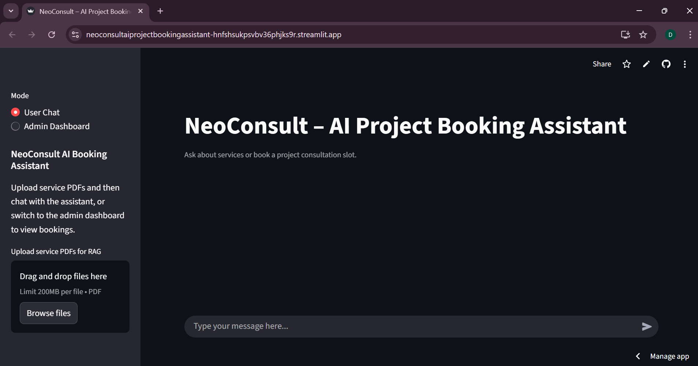
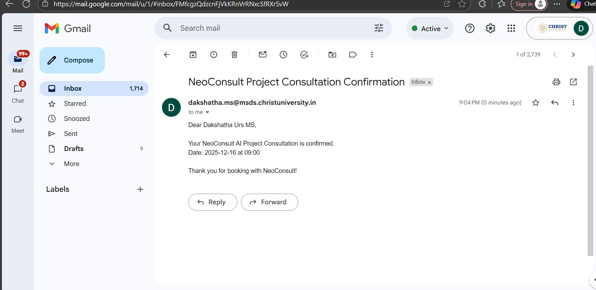
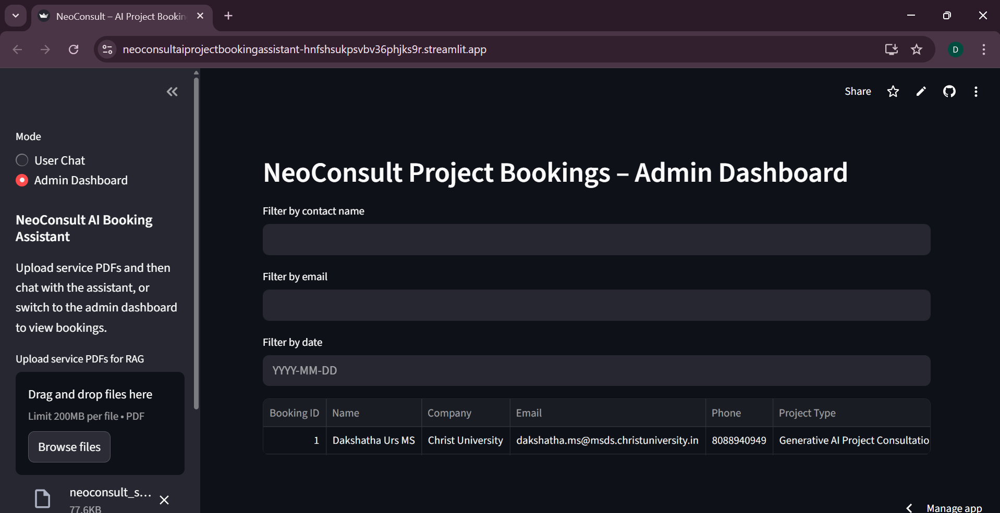

Project Title: NeoConsult - AI Project Booking Assistant

Streamlit App - https://neoconsultaiprojectbookingassistant-hnfshsukpsvbv36phjks9r.streamlit.app/

Domain:
AI-powered Consultation Booking System for NeoStats / NeoConsult (Data & AI Solutions)

Objective:

To design and implement an AI-powered assistant that:
Handles document-based Q&A (RAG)
Books project consultations
Stores bookings in a database
Sends confirmation emails
Provides an admin dashboard to view all bookings

Features Implemented:

Task	Description	Status:
Streamlit Frontend:	Modern UI with two modes: “User Chat” and “Admin Dashboard.”	
RAG Integration (PDF Q&A): Upload NeoConsult brochure PDFs : Ask natural language questions.
Chat Memory + Context: Maintains conversation history between turns.	
Fallback Summarization :(No API)	Automatically summarizes PDF content if OpenAI API limit is hit.	
Booking Flow: Multi-turn chat flow collects name, company, email, phone, type, date, time, and confirmation.	
Database (SQLite): Bookings stored in bookings.db.	
Email Confirmation (SMTP): Sends booking confirmation email (App Password Gmail).
Admin Dashboard	Filters by name, email, and date; shows all bookings neatly.	
Error Handling	Handles invalid email, API failures, and missing DB gracefully.	
Cloud Deployment 

Database Schema (bookings.db)
Table	Fields
customers	id, name, email, phone, company
bookings	id, customer_id, booking_type, date, time

Technologies Used:

Frontend: Streamlit
Backend: Python, SQLAlchemy ORM
Database: SQLite
AI Model: OpenAI GPT-4o-mini (for RAG and chat logic)
Embedding / Retrieval: FAISS / sentence-transformers
Email Service: Gmail SMTP (App Password Auth)
Cloud Deployment : Streamlit Cloud 

Project Structure:

AI_UseCase/
│
├── app.py                                 
│
├── app/                                   
│   ├── __init__.py                        
│   ├── chat_logic.py                      
│   ├── booking_flow.py                    
│   ├── tools.py                           
│   ├── rag_pipeline.py                    
│   ├── admin_dashboard.py                 
│   └── config.py                          
│
├── db/                                    
│   ├── models.py                         
│   ├── database.py                        
│   └── session.py                         
│
├── utils/                                 
│   └── validators.py                      
│
├── docs/                                  
│   ├── neoconsult_brochure.pdf          
│   └── architecture_diagram.png          
│
├── .streamlit/                         
│   └── secrets.toml                       
│
├── bookings.db                           
│
├── requirements.txt                
│
├── README.md     

How to Run Locally:

pip install -r requirements.txt
streamlit run app.py
Then upload the NeoConsult brochure (PDF) and start chatting or booking consultations.

Deployment:

Live Demo: https://neoconsultaiprojectbookingassistant-hnfshsukpsvbv36phjks9r.streamlit.app/

The application has been deployed successfully on Streamlit Cloud, enabling interactive access to all core features including PDF-based Q&A, AI-driven booking flow, and the Admin Dashboard.

Application Preview:

Below are a few snapshots of the deployed **NeoConsult – AI Project Booking Assistant** showcasing key functionalities.

User Chat Interface:
The assistant allows users to upload NeoConsult service PDFs, ask questions using natural language, and interact conversationally for project consultation bookings.

Automated Consultation Flow:
Once the user completes the multi-turn conversation, all booking details (name, email, date, project type, etc.) are collected and stored securely in the database.

Admin Dashboard:
Admins can view and filter all bookings through a dedicated dashboard integrated with the SQLite database.

Deployment Options:

Option 1 — Streamlit Cloud (Recommended)
The app can be deployed directly on Streamlit Cloud by connecting the GitHub repository and setting the main entry point as app.py.

Option 2 — Render
Alternatively, the app can be hosted on Render using the same project structure and startup command:
streamlit run app.py

Environment Configuration:

Sensitive credentials are securely managed through Streamlit Secrets Management.
Add the following entries in .streamlit/secrets.toml or in Streamlit Cloud’s “Edit Secrets” panel:

OPENAI_API_KEY = "your_key"
EMAIL_HOST = "smtp.gmail.com"
EMAIL_PORT = "587"
EMAIL_USER = "your_email@gmail.com"
EMAIL_PASSWORD = "your_app_password"

Note: These credentials should not be committed to the repository for security reasons. They are configured only in the deployment environment.

Access Instructions:

Open the live demo link above.
Upload the company brochure (neoconsult_brochure.pdf).
Ask document-related queries or initiate a project consultation booking.
view and manage bookings via the Admin Dashboard in the sidebar.

Deployment Summary:

Hosting Platform: Streamlit Cloud
Frontend: Streamlit
Backend: Python + SQLite
Secrets Management: Streamlit Cloud Secrets
Status: Successfully deployed and accessible online

Summary - This project demonstrates an end-to-end AI-powered booking system integrating:

RAG-based document querying
Dynamic conversation handling
Booking persistence and email confirmation
Admin analytics dashboard
Built with Streamlit, SQLite, OpenAI API, and Python, and ready for cloud deployment.
